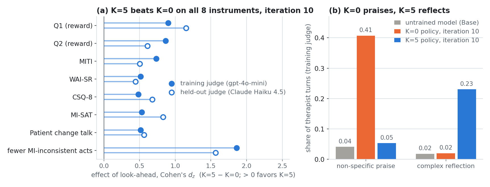

# Looking Ahead in Goal-Oriented Dialogue

**Comparing Preference-Tree and Group-Relative Optimization of Small Language Models for Motivational Interviewing** —
master's thesis, Lior Baruch, Reichman University.

Motivational Interviewing (MI) is a counseling style that helps people resolve their ambivalence
about changing a behavior such as smoking: the counselor asks, listens and reflects the person's own
reasons for change rather than persuading or praising. Whether a counselor's turn was good often
shows only in how the conversation continues. We train a small "therapist" language model
(Llama-3.2-1B) to hold MI sessions with simulated patients, rewarded by a larger LLM judge that
fills in MI questionnaires, and ask how far that reward should look ahead: should a therapist turn
be scored on its own, or together with the next few turns it leads to? We compare this look-ahead
reward under two optimizers: **Preference Tree Optimization (PTO)**, our earlier method
([arXiv:2608.12062](https://arxiv.org/abs/2608.12062)), and **Group Relative Policy Optimization
(GRPO)** ([Shao et al., 2024](https://arxiv.org/abs/2402.03300)).

## Results

The main result compares two GRPO runs that are identical except for the reward horizon: **K=0**
scores each candidate therapist turn alone, **K=5** scores it together with the five simulated
utterances that follow it. Each run trains for ten iterations (each iteration: 96 new
conversations with the current model, then an update). Every model is evaluated on the same 96
simulated patients by two judges, so comparisons are paired by patient; the effect size is
Cohen's d_z, the mean paired difference divided by its standard deviation.

<picture>
  <source media="(prefers-color-scheme: dark)" srcset="docs/assets/results_dark.png">
  
</picture>

- **Look-ahead wins on all eight instruments.** At iteration 10 the K=5 policy is ahead of the K=0
  policy on every evaluation instrument, under both the training judge and a held-out judge from
  another model family (Wilcoxon signed-rank tests, all p < .001 after Holm correction across the
  instruments). On the reward questionnaires (the mean of Q1 and Q2, 1–5) the training judge scores
  the untrained model 3.01, K=0 3.75 and K=5 4.52. K=5's gain over the untrained model is 1.3 to
  2.5 times K=0's, depending on the judge and on whether K=0 is taken at its last checkpoint or at
  its best one (iteration 8, chosen by the training judge).
- **The two policies learn different habits.** Coded utterance by utterance by the training judge
  (panel b), K=0 learns non-specific praise (41% of its turns, against 4% for the untrained model),
  including in reply to the patient's resistance; K=5 learns complex reflections, which restate
  what the patient said with added meaning (23%, against 2%). After a patient voices change talk,
  a statement in favor of changing, the next patient utterance is change talk again 97% of the time
  under K=5, 80% under K=0 and 75% for the untrained model (averaged over conversations).
- **It is not a clean MI win.** K=5 answers resistance with persuasion, which MI counts as
  inconsistent (39% of those replies, against 24% for the untrained model). Its rate of
  MI-inconsistent acts per turn ends equal to the untrained model's under the training judge and
  above it under the held-out judge, which also sees K=5's praise rise from 4% to 20% of turns.
- **The optimizer matters.** Across all four runs (2 optimizers × 2 horizons, at iteration 10), PTO
  beats GRPO at K=0 (Q1+Q2, d_z 0.73 training judge / 1.27 held-out) and GRPO beats PTO at K=5
  (0.36 / 0.31), and look-ahead made no significant difference to PTO's Q1+Q2. PTO is also far
  cheaper: 8.1 and 19.7 GPU-hours for ten iterations, against GRPO's 27.9 and 51.2 (K=0 / K=5).

Caveats: one training run per configuration, simulated patients, LLM judges, no human evaluation,
and the eight instruments are correlated rather than independent confirmations. Every number above
is read from the tracked analysis tables under
[`Exp3_PTO_GRPO/eda/results/`](Exp3_PTO_GRPO/eda/results/README.md) (`lookahead/` for the GRPO
results, `method/` and `compute/` for PTO vs GRPO and cost); the figure is drawn from them by
[`docs/make_readme_figure.py`](docs/make_readme_figure.py).

## How it works

- **Therapist:** Llama-3.2-1B (the pretrained, not instruction-tuned, checkpoint) with LoRA
  adapters in bf16, prompted as an MI counselor.
- **Patients:** gpt-4o-mini role-playing 96 personas, one per combination of six attributes: gender,
  age (27 or 61), problem (smoking or obesity), how long they have had it (months or years),
  whether they have tried to change (never or many times), and cooperation (high, low, or low then
  warming up): 2 × 2 × 2 × 2 × 2 × 3 = 96. A session ends when the patient closes it, or at 49
  utterances. Prompts: [`system_prompts_builder.py`](Exp3_PTO_GRPO/code/system_prompts_builder.py).
- **Reward:** gpt-4o-mini fills in two questionnaires built and validated for LLM evaluation of
  simulated MI sessions ([Yosef et al., 2024](https://aclanthology.org/2024.clpsych-1.1/)): Q1
  (5 items, session satisfaction) and Q2 (17 items, the therapist–patient relationship). The reward
  is the mean of the two, on the conversation so far.
- **Look-ahead (K):** before scoring a candidate therapist turn, the patient simulator and the
  current policy continue the conversation for K more utterances (patient, therapist, patient, ...),
  and the judge scores the extended transcript. K=0 is the usual turn-level reward.
- **GRPO:** each iteration the policy conducts 96 new conversations; every prefix that ends on a
  patient turn and has at least 12 utterances becomes a prompt; 8 candidate turns are sampled and
  scored (with look-ahead when K > 0), and the update uses the group-standardized scores.
- **PTO:** starting from 12-utterance prefixes, the policy grows a preference tree: at each
  therapist turn it samples 8 candidates, scores them the same way, keeps the best and the worst as
  a preference pair when their scores differ enough, continues the conversation with the best, and
  trains with DPO. The two optimizers share the simulator, the judge, the look-ahead code and these
  settings, which is what makes the comparison controlled.
- **Evaluation:** every model state is scored on eight instruments by the training judge and by a
  held-out judge (Claude Haiku 4.5): Q1, Q2, WAI-SR (working alliance), CSQ-8 (client
  satisfaction), MI-SAT (intervention satisfaction), MITI (MI treatment-integrity global ratings),
  PCT (the patient's change talk) and MICI (MI-inconsistent acts per therapist turn; lower is
  better). Each judge also labels every utterance with an MI code (open question, complex
  reflection, non-specific praise, persuasion, change talk, ...), which panel (b) counts. Rubrics:
  [`questionnaires.py`](Exp3_PTO_GRPO/code/questionnaires.py).

The trainers can also use another questionnaire as the reward; that comparison has not been run.

## Repository layout

| Directory | What it holds |
|---|---|
| [`Exp3_PTO_GRPO/`](Exp3_PTO_GRPO/) | **The main experiment**: the PTO and GRPO trainers ([`code/`](Exp3_PTO_GRPO/code/README.md)), the evaluation and analysis package ([`eda/`](Exp3_PTO_GRPO/eda/README.md)), and every rendered table and figure ([`eda/results/`](Exp3_PTO_GRPO/eda/results/README.md)) |
| [`Exp1_ICLR2025/`](Exp1_ICLR2025/) | The original PTO experiments (Llama-2-7B, GPT-3.5), frozen as published |
| [`Exp2_PTO/`](Exp2_PTO/) | PTO with a 4-bit Llama-3.2-1B, a stronger judge (gpt-4o-mini), harder patients and six questionnaires. Its scores are not on Exp3's scale (4-bit quantization degrades the model), and its early GRPO notebooks had a bug: their results are void |
| [`Exp4_OpenStack/`](Exp4_OpenStack/) | Side project: the same comparison on a fully open model stack (Gemma behind vLLM) |
| [`papers/`](papers/README.md) | The published PTO paper and the current draft (LaTeX, with a `NUMBERS.md` ledger tying every number to its table) |
| [`meetings/`](meetings/README.md) | Supervisor decks and the scripts that build them |
| [`docs/`](docs/DEVELOPMENT.md) | Maintainer notes (keys, data policy, Colab ↔ local sync) and this README's figure |

## Papers

| | Status |
|---|---|
| Baruch, Butman, Bar and Friedman. *Preference Tree Optimization: Enhancing Goal-Oriented Dialogue with Look-Ahead Simulations.* ICLR 2025 Workshop SSI-FM. [arXiv:2608.12062](https://arxiv.org/abs/2608.12062) · [folder](papers/2025_iclr_pto_lookahead/) | published |
| *GRPO with Look-Ahead in Motivational Interviewing: Rewarding a Therapist Turn by Where It Leads* · [source](papers/2026_grpo_lookahead_mi/) | in preparation (ARR, October 2026) |
| The thesis | in progress |

## Running it

Python 3.13. Training needs a GPU (we used Colab A100s); scoring and analysis run on a laptop.

```bash
python -m venv .venv
.venv\Scripts\activate            # Windows; on Linux/macOS: source .venv/bin/activate
pip install torch --index-url https://download.pytorch.org/whl/cu128   # pick the wheel for your CUDA, or omit for CPU
pip install -r requirements.txt
```

You need an OpenAI key (patient simulator and judge), a Hugging Face token (Llama-3.2-1B is gated)
and, for the held-out judge, an Anthropic key. Put them in `Exp3_PTO_GRPO/` as `openai_key.txt`,
`HF_key.txt` and `anthropic_key.txt` (git-ignored). The first two are required even if you also set
the keys as environment variables, because the code finds the experiment folder by looking for
them; see [docs/DEVELOPMENT.md](docs/DEVELOPMENT.md#api-keys).

- **Train:** open
  [`train_GRPO_Iterative.ipynb`](Exp3_PTO_GRPO/code/GRPO_Exp3/train_GRPO_Iterative.ipynb) or
  [`train_PTO_Iterative.ipynb`](Exp3_PTO_GRPO/code/PTO_Exp3/train_PTO_Iterative.ipynb); cell 1
  holds every setting (horizon K, group size, ...). The reported runs used `NUM_ITERATIONS = 10`
  (the notebooks ship with smaller defaults).
- **Score:** [`Run_Eval.ipynb`](Exp3_PTO_GRPO/eda/notebooks/scoring/Run_Eval.ipynb) scores every
  conversation with the training judge (resumable);
  [`Judge_Reliability.ipynb`](Exp3_PTO_GRPO/eda/notebooks/scoring/Judge_Reliability.ipynb) runs the
  held-out judge.
- **Analyze:** `python tools/render_results.py` from `Exp3_PTO_GRPO/eda/` regenerates every table
  and figure from the scores; the [EDA README](Exp3_PTO_GRPO/eda/README.md) explains the package.

The rendered tables and figures are in this repository; the raw data (conversations, adapters,
judge scores) is not, so a fresh clone can read every result but needs its own runs to regenerate
them ([docs/DEVELOPMENT.md](docs/DEVELOPMENT.md#data--large-artifacts-not-in-git)).

## Citation

If you use PTO or the look-ahead reward, please cite:

```bibtex
@inproceedings{baruch2025pto,
  author        = {Baruch, Lior and Butman, Moshe and Bar, Kfir and Friedman, Doron},
  title         = {Preference Tree Optimization: Enhancing Goal-Oriented Dialogue with
                   Look-Ahead Simulations},
  booktitle     = {ICLR 2025 Workshop on Scaling Self-Improving Foundation Models
                   without Human Supervision (SSI-FM)},
  year          = {2025},
  eprint        = {2608.12062},
  archivePrefix = {arXiv},
  primaryClass  = {cs.CL},
  url           = {https://arxiv.org/abs/2608.12062}
}
```

## License

MIT — see [LICENSE](LICENSE).
